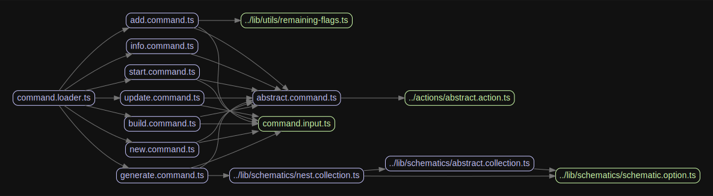

# 源码分析

## 文件结构

``` bash
├── actions
|  ├── abstract.action.ts - 抽象类，用于约束子类实现
|  ├── add.action.ts
|  ├── build.action.ts
|  ├── generate.action.ts
|  ├── index.ts
|  ├── info.action.ts
|  ├── new.action.ts - new命令后的相关操作
|  ├── start.action.ts
|  └── update.action.ts
├── bin
|  └── nest.ts - 注册入口文件，将commander模块传入commands/index.ts的load方法。
├── commands
|  ├── abstract.command.ts - 抽象类，用于给其他子命令实现
|  ├── add.command.ts - 和new的实现类似，最终都是声明参数，拼接输入后，调用对应的action.handle
|  ├── build.command.ts - 和new的实现类似，最终都是声明参数，拼接输入后，调用对应的action.handle
|  ├── command.input.ts - 仅暴露接口Input
|  ├── command.loader.ts - 进行所有子命令的初始化。
|  ├── generate.command.ts - 和new的实现类似，最终都是声明参数，拼接输入后，调用对应的action.handle
|  ├── index.ts - 直接对外暴露commands/command.loader.ts和commands/command.input.ts
|  ├── info.command.ts - 和new的实现类似，最终都是声明参数，拼接输入后，调用对应的action.handle
|  ├── new.command.ts - 提供new命令
|  ├── start.command.ts - 和new的实现类似，最终都是声明参数，拼接输入后，调用对应的action.handle
|  └── update.command.ts - 和new的实现类似，最终都是声明参数，拼接输入后，调用对应的action.handle
├── e2e - 集成测试相关
├── gulpfile.js
├── lib
|  ├── compiler
|  |  ├── assets-manager.ts
|  |  ├── compiler.ts
|  |  ├── defaults
|  |  |  └── webpack-defaults.ts
|  |  ├── helpers
|  |  |  ├── append-extension.ts
|  |  |  ├── get-value-or-default.ts
|  |  |  └── tsconfig-provider.ts
|  |  ├── hooks
|  |  |  └── tsconfig-paths.hook.ts
|  |  ├── plugins-loader.ts
|  |  ├── watch-compiler.ts
|  |  ├── webpack-compiler.ts
|  |  └── workspace-utils.ts
|  ├── configuration
|  |  ├── configuration.loader.ts
|  |  ├── configuration.ts
|  |  ├── defaults.ts
|  |  ├── index.ts
|  |  └── nest-configuration.loader.ts
|  ├── dependency-managers
|  |  ├── index.ts
|  |  └── nest.dependency-manager.ts
|  ├── package-managers
|  |  ├── abstract.package-manager.ts
|  |  ├── index.ts
|  |  ├── npm.package-manager.ts
|  |  ├── package-manager-commands.ts
|  |  ├── package-manager.factory.ts
|  |  ├── package-manager.ts
|  |  ├── project.dependency.ts
|  |  └── yarn.package-manager.ts
|  ├── questions
|  |  └── questions.ts - 封装了选择题和输入题
|  ├── readers
|  |  ├── file-system.reader.ts
|  |  ├── index.ts
|  |  └── reader.ts
|  ├── runners
|  |  ├── abstract.runner.ts
|  |  ├── git.runner.ts
|  |  ├── index.ts
|  |  ├── npm.runner.ts
|  |  ├── runner.factory.ts
|  |  ├── runner.ts
|  |  ├── schematic.runner.ts
|  |  └── yarn.runner.ts
|  ├── schematics
|  |  ├── abstract.collection.ts
|  |  ├── collection.factory.ts
|  |  ├── collection.ts
|  |  ├── custom.collection.ts
|  |  ├── index.ts
|  |  ├── nest.collection.ts
|  |  └── schematic.option.ts
|  ├── ui
|  |  ├── banner.ts
|  |  ├── emojis.ts
|  |  ├── errors.ts
|  |  ├── index.ts
|  |  ├── messages.ts
|  |  └── prefixes.ts
|  └── utils
|     ├── is-error.ts
|     └── remaining-flags.ts
├── scripts
|  └── check-version.js
├── tools
|  └── gulp
|     ├── config.ts
|     ├── gulpfile.ts
|     ├── tasks
|     |  └── clean.ts
|     ├── tsconfig.json
|     └── util
|        └── task-helpers.ts
├── tsconfig.json
├── tslint.json
└── yarn.lock
```

## 外部模块依赖

[过于复杂，参见](http://npm.broofa.com/?q=@nestjs/cli)

## 内部模块依赖



## 逐个文件分析

### bin/nest.ts

注册入口文件，基于commander模块，将模块内容传入commands/index.ts提供的load方法。

默认没参数则输出帮助help。

### commands/index.ts

直接对外暴露commands/command.loader.ts和commands/command.input.ts

### commands/command.loader.ts

进行子命令的初始化。

暴露定义的类CommandLoader。

提供公有静态方法load()，调用commands文件夹下各个子文件如add.command.ts，build.command.ts等暴露的类的load方法，并在初始化类时将actions文件夹下对应的action实例传入构造函数。

提供私有静态方法handleInvalidCommand()基于commander模块自带事件，校验输入命令是否合法。

### commands/new.command.ts

提供new命令，继承自commands/abstract.command.ts的基类。

在load方法钟实现了参数的解析，最后调用this.action.handle来进行真正的处理。

---

### commands/abstract.command.ts

抽象类，用于给其他子命令实现，必须由load方法，且构造函数参数必须是来自actions/abstract.action.ts的AbstractAction类型。


  <p align="center">A progressive <a href="http://nodejs.org" target="blank">Node.js</a> framework for building efficient and scalable server-side applications.</p>
    <p align="center">
<a href="https://www.npmjs.com/~nestjscore"></a>
<a href="https://www.npmjs.com/~nestjscore"></a>
<a href="https://www.npmjs.com/~nestjscore"></a>
  <a href="https://travis-ci.org/nestjs/nest"></a>
<a href="https://travis-ci.org/nestjs/nest"></a>
<a href="https://coveralls.io/github/nestjs/nest?branch=master" target="_blank"></a>
<a href="https://discord.gg/G7Qnnhy" target="_blank"></a>
<a href="https://opencollective.com/nest#backer" target="_blank"></a>
<a href="https://opencollective.com/nest#sponsor" target="_blank"></a>
  <a href="https://paypal.me/kamilmysliwiec" target="_blank"></a>
  <a href="https://twitter.com/nestframework" target="_blank"></a>

## Description

The Nest CLI is a command-line interface tool that helps you to initialize, develop, and maintain your Nest applications. It assists in multiple ways, including scaffolding the project, serving it in development mode, and building and bundling the application for production distribution. It embodies best-practice architectural patterns to encourage well-structured apps.

The CLI works with [schematics](https://github.com/angular/angular-cli/tree/master/packages/angular_devkit/schematics), and provides built in support from the schematics collection at [@nestjs/schematics](https://github.com/nestjs/schematics).

Read more [here](https://docs.nestjs.com/cli/overview).

## Installation

```
$ npm install -g @nestjs/cli
```

## Usage

Learn more in the [official documentation](https://docs.nestjs.com/cli/overview).

## Stay in touch

- Website - [https://nestjs.com](https://nestjs.com/)
- Twitter - [@nestframework](https://twitter.com/nestframework)
